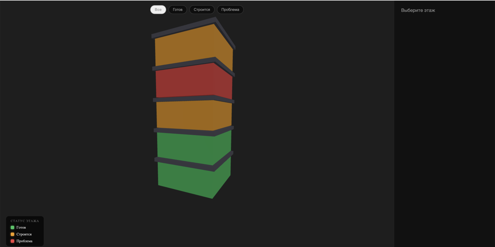
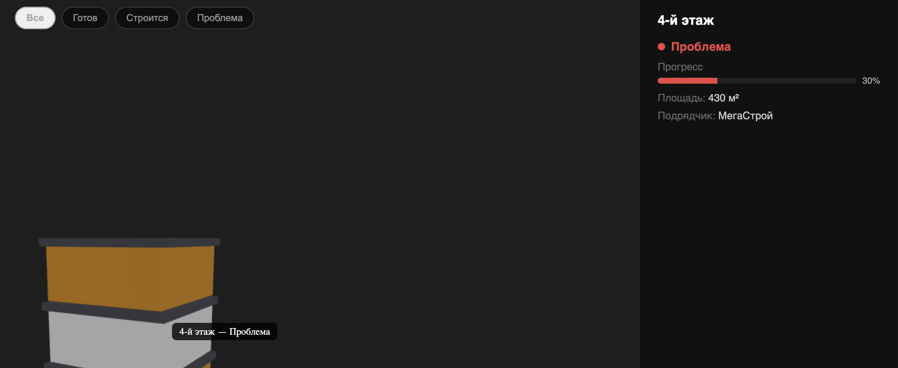
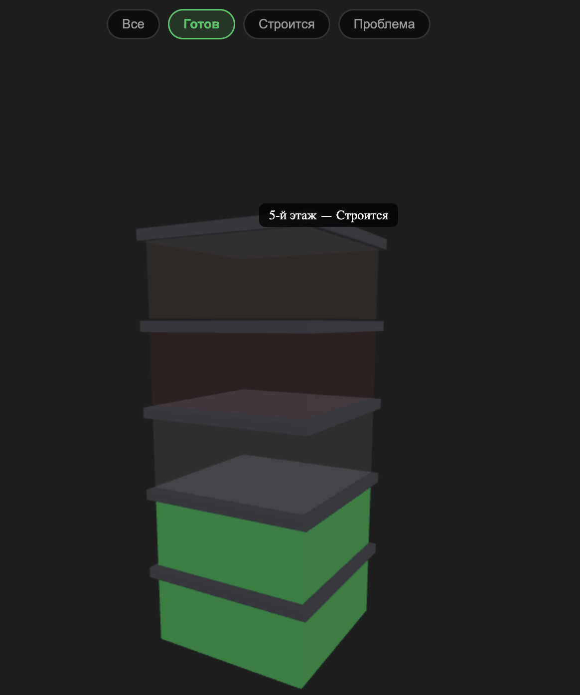
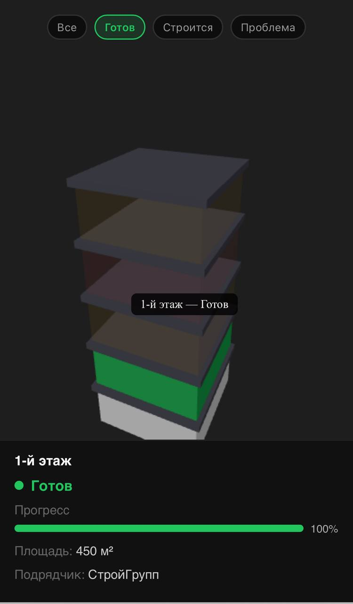

# 3D-визуализатор здания

[](https://github.com/vladislavprozorov/sber-three-react/actions/workflows/deploy.yml)

Демо: [https://vladislavprozorov.github.io/sber-three-react/](https://vladislavprozorov.github.io/sber-three-react/)

---

## Скриншоты

<table>
  <tr>
    <td align="center" width="50%">
      
      <br/>
      <sub>Основной вид — здание с перекрытиями</sub>
    </td>
    <td align="center" width="50%">
      
      <br/>
      <sub>Выбранный этаж — панель с данными и прогрессом</sub>
    </td>
  </tr>
  <tr>
    <td align="center" width="50%">
      
      <br/>
      <sub>Фильтр по статусу — подсветка нужных этажей</sub>
    </td>
    <td align="center" width="50%">
      
      <br/>
      <sub>Мобильный вид — вертикальный layout</sub>
    </td>
  </tr>
</table>

---

## О проекте

Интерактивная 3D-визуализация строящегося здания на React и Three.js.

Проект демонстрирует архитектурное разделение между движком визуализации (Three.js) и логическим слоем приложения (React) — по аналогии с системами управления строительными проектами.

```
Клик пользователя -> Raycaster -> Этаж выбран
                         |
                 Обновление React state
                         |
              Панель отображает данные этажа
```

---

## Функциональность

- 3D-модель здания из 5 этажей на базе Three.js WebGL
- Окраска этажей по статусу строительства из mock API-сервиса
- Raycasting для точного выбора этажа по клику
- Подсветка этажа при наведении и тултип с названием и статусом
- Плавная анимация камеры (lerp) при выборе этажа
- OrbitControls — вращение, масштабирование и панорамирование мышью
- Плиты-перекрытия между этажами для реалистичного вида здания
- Фильтр по статусу — кнопки для подсветки нужных этажей
- Легенда статусов на сцене
- Панель с данными этажа и shimmer-скелетоном во время загрузки
- Адаптивный canvas через ResizeObserver
- Адаптивный layout для мобильных устройств — вертикальный стек на экранах до 768px
- CI/CD — автоматический деплой на GitHub Pages при каждом пуше в main

---

## Стек технологий

| Слой   | Технологии                         |
| ------ | ---------------------------------- |
| UI     | React 18, TypeScript               |
| 3D     | Three.js, OrbitControls, Raycaster |
| Сборка | Vite                               |
| CI/CD  | GitHub Actions, GitHub Pages       |

---

## Архитектура

```
src/
  app/
    App.tsx                      # Корневой компонент — только разметка
    hooks/
      useBuildingViewer.ts       # Хук состояния просмотрщика (этаж, фильтр)
  shared/
    hooks/
      useIsMobile.ts             # Хук определения мобильного устройства
  features/
    building-3d/
      ThreeScene.tsx             # Three.js сцена, камера, raycasting, controls
      StatusLegend.tsx           # Компонент легенды статусов
      StatusFilter.tsx           # Компонент кнопок-фильтров
    building-info/
      BuildingInfoPanel.tsx      # Панель данных этажа с lazy loading
      floorService.ts            # Mock API, типы и маппинги статусов
```

Слои импортируются строго сверху вниз по правилам FSD:

```
app  →  features  →  shared
```

- `useBuildingViewer` живёт в `app/hooks` — это состояние уровня приложения
- `useIsMobile` живёт в `shared/hooks` — это переиспользуемая утилита без бизнес-логики
- `ThreeScene` управляет WebGL-контекстом и передаёт события в React через коллбэки
- `floorService` — слой данных, который можно заменить реальным REST API без изменений в UI

---

## Запуск

```bash
npm install
npm run dev
```

Сборка для продакшена:

```bash
npm run build
```

---

## История веток

| Ветка                       | Описание                                                |
| --------------------------- | ------------------------------------------------------- |
| `feature/enhance-3d-viewer` | Mock API, статусные цвета, hover-тултип, lerp камеры    |
| `feature/status-legend`     | Легенда статусов поверх сцены                           |
| `feature/orbit-controls`    | OrbitControls с затуханием                              |
| `feature/floor-slabs`       | Плиты-перекрытия между этажами                          |
| `feature/status-filter`     | Кнопки-фильтры по статусу                               |
| `feature/mobile-layout`     | Адаптивный layout, хуки useIsMobile и useBuildingViewer |
